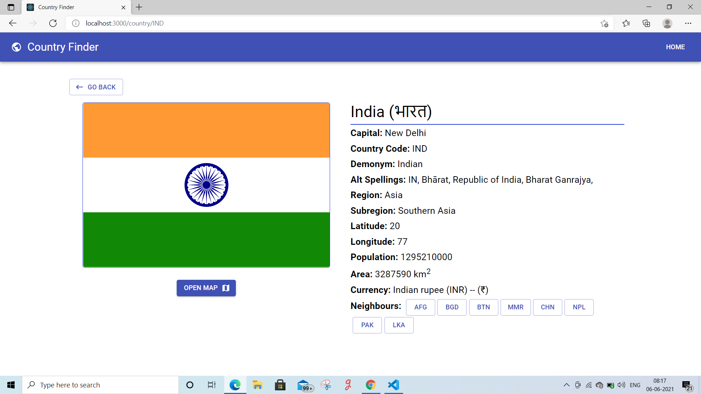

# countryFinder-redux-materialUi

## Set Up

> STEP:1  Clone this repository by following command

```sh
$ git clone https://github.com/jyotiprakash-m/countryFinder-redux-materialUi.git
$ cd countryFinder-redux-materialUi
```
> STEP:2  Then install all the dependencies using below command

```sh
$ npm install 

```
> STEP:3  Now you all set . To run the application use below command

```sh
$ npm start

```
## Screenshots
Some Screenshots of the project



## Live on
I host this application on vercel.com .

> [https://country-finder-app-hazel.vercel.app](https://country-finder-app-hazel.vercel.app)
